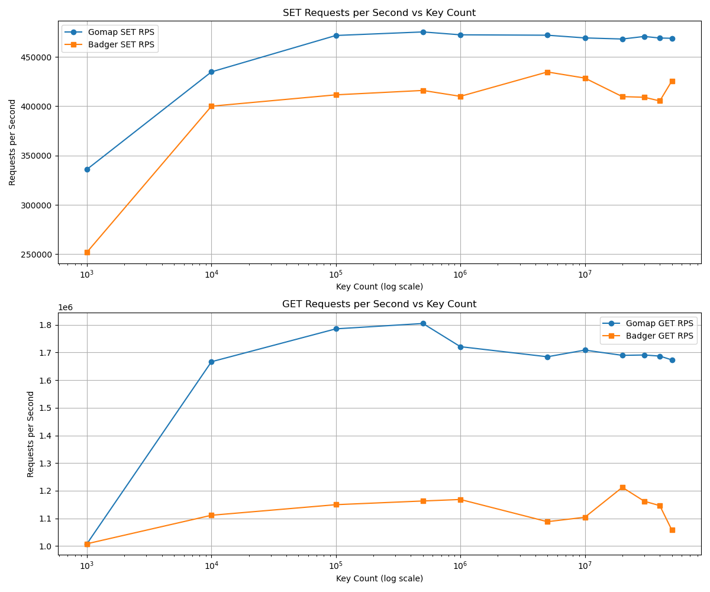

# ⚡️ Gomap — High-Performance Hashmap Storage Engine

**Gomap** is a low-level, memory-mapped storage engine designed for high-performance workloads where **read throughput and latency matter**. Inspired by Redis and engineered as an alternative to LSM-based key-value stores like BadgerDB, Gomap uses custom on-disk hashmaps to deliver blazing-fast `GET` operations at scale.

> “Hashmaps are to reads what LSM trees are to writes — but without the compaction overhead.”

---

## 🚀 Project Goals

- Provide a **Redis-style server interface** backed by Gomap.
- Enable **side-by-side benchmarking** against BadgerDB.
- Showcase performance under large key counts (tested up to **50 million keys**).
- Demonstrate **low-latency, high-throughput** read performance using mmap-backed hashmaps.
- Visualize comparative performance via native Go + Matplotlib plots.

---

## 📦 Features

- Redis protocol compatibility via [`redcon`](https://github.com/tidwall/redcon).
- `SET`/`GET` commands mapped to Gomap or Badger engines.
- Clean benchmark suite with CSV export and performance plots.
- Automated benchmarking via `Makefile`.
- Scales efficiently with large key volumes.

---

## 📈 Performance Comparison

Gomap significantly outperforms BadgerDB in high-read scenarios — especially as key volume increases.

See this chart from our benchmark suite:



| Engine | Keys      | SET RPS     | SET p50 | GET RPS     | GET p50 |
|--------|-----------|-------------|--------|-------------|--------|
| Gomap  | 1,000     | 336,000     | 1.98 ms | 1,008,000   | 0.47 ms |
| Gomap  | 10,000    | 434,782     | 5.03 ms | 1,666,667   | 0.89 ms |
| Gomap  | 1,000,000 | 472,367     | 4.34 ms | 1,721,170   | 0.91 ms |
| Gomap  | 50M       | 468,872     | 4.23 ms | 1,673,304   | 0.94 ms |
| Badger | 1,000     | 251,999     | 3.39 ms | 1,008,000   | 0.52 ms |
| Badger | 1,000,000 | 410,004     | 7.55 ms | 1,168,224   | 0.10 ms |
| Badger | 50M       | 425,659     | 7.23 ms | 1,057,373   | 0.09 ms |

> ✨ **Gomap consistently delivers 30–50% higher GET throughput and 30–60% lower latency than Badger at scale.**

---

## 🔧 Project Structure

```plaintext
gomap/
├── cmd/
│   └── benchmarkmain/       # Entry point for benchmark suite
├── redisserver/
│   ├── gomapredis/          # Redis server wrapper for Gomap
│   └── badgerredis/         # Redis server wrapper for Badger
├── benchmark/
│   ├── config.go            # CLI flag parsing
│   ├── runner.go            # Benchmark orchestration
│   ├── report.go            # CSV + terminal output
│   └── plot.go              # Native Go plot support (optional)
├── benchmark/benchmark_performance_combined.png
├── go.mod
└── ...


