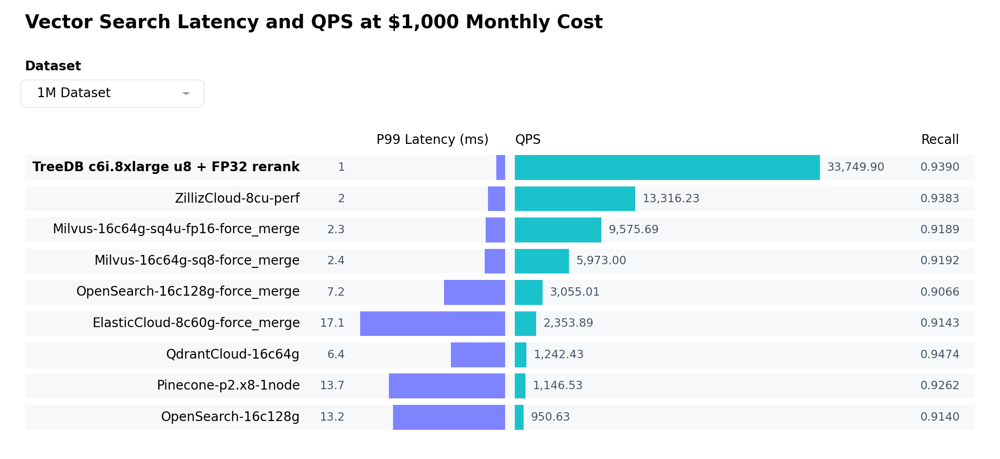
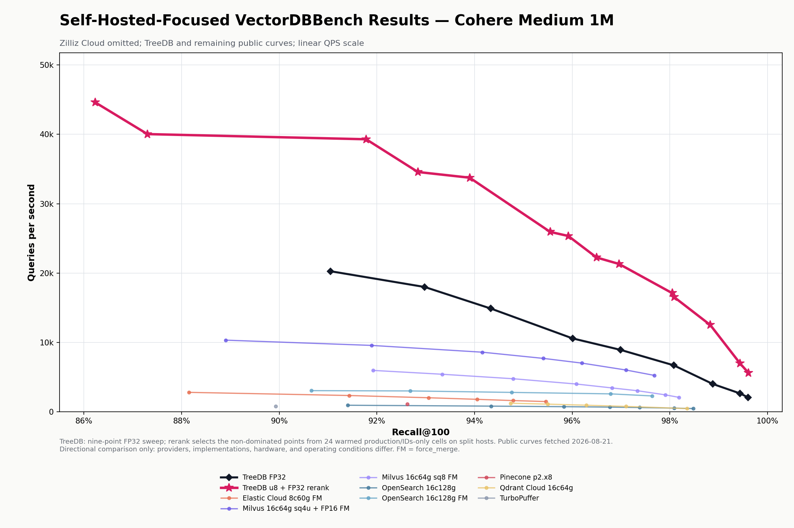

# TreeDB

TreeDB is a pre-alpha persistent storage engine built around a copy-on-write
B+Tree, a persistent value log, and command-WAL recovery. It includes a native
wire server, a Mongo-compatible gateway, a collection/document layer, secondary
indexes, and benchmark tooling for comparing TreeDB against MongoDB and other
engines.

TreeDB is the main focus of this repository. The repo also contains HashDB, an
older mmap-backed hash engine used for experiments and comparison; see
`HashDB/README.md`.

## Status

TreeDB is pre-alpha:

- APIs and on-disk formats may change without backward-compatibility guarantees.
- New binaries may intentionally reject old DB directories.
- Benchmark DB directories should be rebuilt from scratch unless a report says
  otherwise.

## What TreeDB Provides

- Persistent B+Tree index with copy-on-write root publishing.
- Persistent value log for large values and leaf/value placement experiments.
- Command WAL for collection and raw-key redo/recovery.
- Snapshot-isolated readers and exclusive process-level DB directory locking.
- Collection/document APIs with BSON, template-v1, secondary indexes, and vector
  search experiments.
- Native wire protocol through `cmd/treedb-native-server`.
- Mongo-compatible gateway through `TreeDB/mongo_gateway`.
- Benchmark and profiling scripts for YCSB, collections, vector search, and
  storage-engine comparison.

## Quickstart

Build the primary TreeDB servers:

```sh
mkdir -p bin
go build -o bin/treedb-native-server ./cmd/treedb-native-server
go build -o bin/treedb-mongo-gateway ./TreeDB/mongo_gateway/server.go
```

Run the native server:

```sh
./bin/treedb-native-server \
  -dir /tmp/treedb-native \
  -profile command_wal_durable \
  -addr 127.0.0.1:17130
```

Run the Mongo-compatible gateway:

```sh
./bin/treedb-mongo-gateway \
  -dir /tmp/treedb-mongo \
  -profile command_wal_durable \
  -document-format bson \
  -addr 127.0.0.1:27130
```

Minimal Go usage:

```go
package main

import (
	"fmt"
	"log"

	treedb "github.com/snissn/gomap/TreeDB"
)

func main() {
	opts := treedb.OptionsFor(treedb.ProfileCommandWALDurable, "./my-db")
	db, err := treedb.Open(opts)
	if err != nil {
		log.Fatal(err)
	}
	defer db.Close()

	if err := db.Set([]byte("key"), []byte("value")); err != nil {
		log.Fatal(err)
	}
	value, err := db.Get([]byte("key"))
	if err != nil {
		log.Fatal(err)
	}
	fmt.Println(string(value))
}
```

## Profiles

The current public TreeDB profile surface is intentionally small:

- `command_wal_durable`: recommended server default; ordinary acknowledgements
  wait for a durable dependency-closed command-WAL prefix.
- `command_wal_relaxed`: ordinary acknowledgements are relaxed, while every
  explicit `*Sync` waits for a durable dependency-closed command-WAL prefix.
- `no_wal_fast`: production no-WAL profile; ordinary acknowledgements are
  relaxed and every explicit `*Sync` waits for a sealed durable root.
- `bench_unsafe`: benchmark/test-only ceiling with no durability promise. It is
  available only through the explicit benchmark constructor/parser boundary.

All three production profiles verify value-log integrity. `Flush` is a
visibility/drain operation, not a durability boundary. `Checkpoint` and clean
`Close` wait for a sealed durable root.

Legacy Go aliases are retained only for compatibility and focused low-level
tests. CLI and environment parsers accept only canonical underscore names.

More detail: `docs/TREEDB_PROFILES.md` and `docs/TREEDB_WRITE_PATHS.md`.

## Benchmarking

These checked-in reports use different workloads, profiles, and caveats. Treat
each workload as scoped evidence from its linked benchmark, not as one combined
benchmark suite.

### VectorDBBench Cohere 1M

End-to-end VDBBench search on Cohere Medium 1M (768-dimensional cosine,
`topK=100`, IDs-only responses), with separate c6i.8xlarge client and server
hosts. The budgeted TreeDB server was 32 vCPUs and 64 GiB at exactly
$1,000/month. The two canonical TreeDB curves are FP32 HNSW traversal and
scalar-u8 traversal with FP32 reranking.





| TreeDB curve | about 0.98 recall | about 0.994 recall | highest measured recall |
| --- | ---: | ---: | ---: |
| u8 + FP32 rerank | 16,532 QPS @ 0.9809 | 6,969 QPS @ 0.9944 | 5,626 QPS @ 0.9961 |
| FP32 | 6,709 QPS @ 0.9808 | 2,649 QPS @ 0.9944 | 2,093 QPS @ 0.9960 |

The public curves are a directional leaderboard overlay, not same-hardware
reproductions. Full methodology, latency, profiles, supporting quantized-only
measurements, raw data, and evidence archive:
[August 21 Cohere 1M report](docs/benchmarks/treedb_vectordbbench_cohere1m_c6i_dense_curve_2026-08-21.md).

### VectorDBBench Cohere 10M Lifecycle

A production-shaped AWS run durably loaded 10 million Cohere vectors, built the
deferred column graph, cold-reopened the database, and served the optimized
scalar-u8 traversal plus effective 192-row FP32-rerank route (configured maximum
400).

| Measurement | Result |
| --- | ---: |
| Durable ingestion | 502.31 s; 19,908 vectors/s |
| Sustained throughput | M10/M2 81.71% |
| Offline optimize | 6,296.34 s |
| Query-ready load plus optimize | 6,798.65 s |
| Cold reopen | 10,000,000 rows exact; optimized route, no fallback |
| Search | 21,986.66 QPS |
| Recall@100 / NDCG@100 | 0.9335 / 0.9425 |
| Concurrent p99 | 2.164 ms |

Adjacency construction took 5,774.24 seconds and represented 92.5% of
column-graph build time. Full topology, lifecycle gates,
profiles, bottleneck attribution, raw evidence, archive, and caveats:
[September 1 Cohere 10M lifecycle report](docs/benchmarks/treedb_vectordbbench_cohere10m_lifecycle_2026-09-01.md).

### YCSB Server Workload

External `go-ycsb`, local loopback TCP, `recordcount=100000`,
`operationcount=10000`, `threadcount=16`, BSON document format, and zero YCSB
operation errors. Run rows use the median total-throughput repeat from the
latest-main June 3 HST / June 4 UTC report.

| target | profile | load ops/sec | run ops/sec | run avg us | run p99 us |
| --- | --- | ---: | ---: | ---: | ---: |
| MongoDB 8 | baseline | 38,755.4 | 26,494.1 | 595.0 | 1,275.0 |
| TreeDB nativewire | `command_wal_durable` | 83,217.0 | 135,318.6 | 113.0 | 367.0 |
| TreeDB Mongo gateway | `command_wal_durable` | 68,218.2 | 80,628.4 | 199.0 | 649.0 |

Full report, commands, host context, run repeats, and artifact paths:
[June 3 latest-main YCSB report](docs/benchmarks/ycsb_latest_main_2026-06-03.md).

### Indexed Collection Insert Workload

Two secondary indexes, June 17 UTC full benchmark refresh, `100000` documents,
batch size `16000`, and `command_wal_relaxed` for TreeDB. `docs/sec`
is the timed insert measurement for the value-log outer-leaf layout. Compacted
B/doc uses the byte-minimized `exhaustive_compact` row for TreeDB template-v1 and
SQLite after `VACUUM`; TreeDB JSON is omitted from the README compacted-size
headline until the canonical exhaustive fixture covers that format.

| engine / format | layout | docs/sec | compacted B/doc |
| --- | --- | ---: | ---: |
| TreeDB template-v1 | data and index outer leaves in value log | 746,269 | 22.8 |
| TreeDB JSON | data and index outer leaves in value log | 527,148 | — |
| SQLite native columns | WAL normal | 385,654 | 156.7 |
| SQLite JSON | WAL normal | 333,444 | 231.7 |

Source:
[June 17 full benchmark refresh](docs/benchmarks/full_benchmark_report_2026-06-17.md).

### Collection Read And Lookup Workload

Two secondary indexes, April 27 collection/SQLite matrix.

| operation | TreeDB template-v1 ops/sec | TreeDB JSON ops/sec | SQLite native columns ops/sec | SQLite JSON ops/sec |
| --- | ---: | ---: | ---: | ---: |
| Primary read | 771,803 | 524,843 | 357,398 | 473,634 |
| Unique secondary lookup | 815,661 | 845,785 | 484,574 | 442,478 |
| Nonunique secondary lookup | 243,625 | 257,356 | 68,815 | 39,399 |

Source:
[April 27 collection/SQLite matrix](docs/benchmarks/collections_rewrite_vacuum_matrix_pr1075_2026-04-27.md).

### Collection Concurrency Workload

The collection insert/read/lookup rows above are single benchmark-driver rows.
For concurrent collection-layer reads and mixed read/write evidence, use the
separate concurrency report. In the June 4 run, TreeDB template-v1 primary reads
into a caller buffer measured 332.3 ns/op at `GOMAXPROCS=12`; mixed primary
reads with one writer measured 2.96M reader ops/sec and 44.3k writer docs/sec.

Source:
[June 4 collection concurrency report](docs/benchmarks/collections_concurrency_main_2026-06-04.md).

### Vector Search Serving Workload

Dated Tier S exact-FP32 no-document snapshot: Apple M3 (`darwin/arm64`),
2026-06-05, commit `2feb1f0e35459d1b3d044008203d0c8afcf5630f`, `10000`
documents, `64` dimensions, `M=16`, `efConstruction=128`, `efSearch=128`,
`topK=10`, query stream length `16`, `BENCHTIME=1000x`, and `COUNT=3`. TreeDB
rows use warmed persisted `column_graph` / `hnsw_search_pack_v1` no-document
routes. USearch rows are pure in-memory external ANN baselines, not
persistence-equivalent storage rows.

| row | cpu | median ns/op | derived ops/sec | B/op | allocs/op |
| --- | ---: | ---: | ---: | ---: | ---: |
| TreeDB `Collection.SearchVectorIndexWithBuffer` | 1 | 43,049 | 23,229 | 0 | 0 |
| TreeDB `OpenVectorIndexSearcher` + `SearchWithBuffer` parallel row | 8 | 8,610 | 116,144 | 0 | 0 |
| USearch `Search` | 1 | 30,065 | 33,261 | 136 | 3 |
| USearch `SearchParallel` | 8 | 6,906 | 144,802 | 139 | 3 |

Source and reproduction workflow:
[TreeDB vs USearch vector benchmark workflow](TreeDB/docs/guides/vector-search-benchmark-workflow.md).
API chooser, route guardrails, and runnable exact-only demo:
[high-QPS collection vector-search guide](TreeDB/docs/guides/vector-search-high-qps-collection-api.md)
and [`cmd/treedb_vector_highqps_demo`](cmd/treedb_vector_highqps_demo/README.md).

### TreeDB Mongo Gateway Client-Shape Workload

Gateway-shaped BSON documents, `200000` documents, batch size `1000`,
16 insert producers, two secondary indexes (`email`, `city`), TreeDB
`command_wal_relaxed`, settled read state, and 16 concurrent readers for the
read phases. This benchmark keeps TreeDB storage constant while changing the
client/protocol boundary.

| TreeDB access path | load docs/sec | concurrent `_id` reads/sec | concurrent indexed `email` reads/sec | `_id` p95 us | `email` p95 us |
| --- | ---: | ---: | ---: | ---: | ---: |
| Direct collection API | 299,777 | 2,026,834 | 230,846 | 6 | 813 |
| Mongo raw wire over TCP | 283,472 | 276,187 | 65,365 | 81 | 627 |
| TreeDB native wire over TCP | 271,948 | 115,712 | 66,917 | 213 | 618 |
| Mongo driver raw command | 276,503 | 124,961 | 70,215 | 197 | 580 |
| Mongo driver command | 253,315 | 130,387 | 69,213 | 191 | 596 |
| Mongo driver CRUD | 228,906 | 115,262 | 62,586 | 221 | 643 |
| Mongo driver unacknowledged writes | 233,169 | 114,026 | 68,454 | 219 | 601 |

`Direct collection API` is the TreeDB collection/storage ceiling, not a
Mongo-compatible protocol row. `Mongo driver unacknowledged writes` is not a
durability-equivalent default. Use this table to compare TreeDB access-path
overhead; compare against MongoDB only when client mode and acknowledgement
semantics match.

Source:
[June 4 fast Mongo/native client-shape matrix](docs/benchmarks/mongo_gateway_fast_client_matrix_2026-06-04.md).

### Mongo API Full-Sweep Workload

June 17 UTC full benchmark refresh, Docker MongoDB 8 baseline, `100000` BSON
documents, TreeDB Mongo gateway `driver-command-raw`, and `command_wal_relaxed`.
The full-sweep load rows include the additional `age_1` range index even when
the displayed secondary-index count is `0`.

| secondary indexes | TreeDB load docs/sec | MongoDB load docs/sec | TreeDB `_id` r16 ops/sec | MongoDB `_id` r16 ops/sec | TreeDB physical MiB | MongoDB physical MiB |
| ---: | ---: | ---: | ---: | ---: | ---: | ---: |
| 0 | 549,311 | 454,224 | 137,313 | 34,396 | 68.66 | 213.38 |
| 1 | 422,113 | 255,638 | 121,289 | 34,727 | 69.38 | 216.94 |
| 2 | 448,003 | 206,858 | 129,211 | 34,566 | 69.66 | 217.52 |

Source:
[June 17 full benchmark refresh](docs/benchmarks/full_benchmark_report_2026-06-17.md).

### Vector Search Server Matched-Recall Matrix

Current-main Linux/amd64 snapshot for deterministic `100k` and `250k`, 128d
cosine top-10 corpora. Each row selects the lowest tested `efSearch` whose
median recall@10 is at least `.90`; each cell is the median of three serialized,
counterbalanced repetitions with 1,000 measured queries. Search QPS excludes
index construction.

| system | corpus | selected EF | recall@10 | c=1 QPS / p95 | c=32 QPS / p95 |
| --- | ---: | ---: | ---: | ---: | ---: |
| TreeDB single daemon / four groups | 100k | 64 | .9525 | 2,198.0 / 0.537 ms | 10,852.5 / 4.866 ms |
| pgvector | 100k | 64 | .9251 | 1,255.6 / 0.965 ms | 3,745.6 / 15.390 ms |
| Milvus Standalone | 100k | 64 | .9210 | 644.8 / 1.931 ms | 2,256.7 / 25.410 ms |
| TreeDB single daemon / four groups | 250k | 128 | .9580 | 1,525.3 / 0.791 ms | 6,220.6 / 8.466 ms |
| pgvector | 250k | 128 | .9229 | 385.5 / 3.580 ms | 1,712.9 / 36.690 ms |
| Milvus Standalone | 250k | 128 | .9336 | 559.8 / 1.997 ms | 2,141.3 / 26.670 ms |

TreeDB uses one OS daemon with one public coordinator and four logical serving
groups; pgvector uses one PostgreSQL container; Milvus uses Standalone plus
etcd and MinIO. Full EF curves, repetition ranges, topology, resource controls,
and caveats are in the
[August 12 matched-recall report](docs/benchmarks/treedb_vector_server_matched_recall_2026-08-12.md)
and its [machine-readable result](docs/benchmarks/treedb_vector_server_matched_recall_2026-08-12.json).

TreeDB is also wired into `snissn/vectordbbench` through the document service.
Those rows measure Python/client/HTTP/service overhead and are separate from
native Go `0 B/op` no-document evidence; see the
[TreeDB VectorDBBench runbook](docs/benchmarks/treedb_vectordbbench_runbook_2026-06-11.md).

### `application.db` Offline Density Workload

Offline compacted-size comparison from the June 2 Celestia `application.db`
rerun.

| engine | compacted size | workflow |
| --- | ---: | --- |
| TreeDB | 1.690 GiB | `command_wal_relaxed`, rebuild, `CompactStorageFull`, offline index vacuum |
| PebbleDB | 2.108 GiB | snappy, 64 KiB blocks, 64 MiB target files, full compact |
| goleveldb | 2.221 GiB | snappy, 64 KiB blocks, restart interval 256, full compact |

Source:
[June 2 density rerun](docs/benchmarks/application_db_engine_matrix_2026-06-02.md).

### Indexed Text/Vector/Hybrid Insert And Search Workload

The #2589 optimized context rows use the #2564 fixture on an active Apple M3 laptop:
`256` JSON documents, scalar indexes on `tenant`/`region`, a `lexical`
title/body text index (new text indexes default to text-v2; v1 is explicit
compatibility), and an exact cosine column graph (`dims=16`, `M=8`). The
insert row times `InsertBatch` + `Flush` + `RebuildVectorIndex`; search rows
build/index the fixture before timing and then time the search API call only.
Original #2564 rows remain in the linked runbook for context; treat these as
same-host/context evidence, not universal throughput claims.

| row | timed boundary | ns/op median | ops/sec | B/op | allocs/op | allocation delta vs #2564 context | key counters |
| --- | --- | ---: | ---: | ---: | ---: | --- | --- |
| Indexed insert/readiness | 256-doc batch insert + flush + vector rebuild | 68,588,625 | 14.58 ops/sec / 3,732.4 docs/sec | 7,902,142 | 31,953 | B/op -28.3%; allocs/op -71.8% | 141,939 insert ns/doc; 130,717 vector rebuild ns/doc |
| Text candidates | `SearchHybridTextCandidates`, no docs | 140,917 | 7,096.38 | 109,298 | 878 | B/op -74.3%; allocs/op -88.4% | 64 text candidates; 0 docs fetched; 0 fail/fallback |
| Vector candidates | `SearchHybridVectorCandidates`, no docs | 20,584 | 48,582.60 | 36,408 | 82 | B/op 0.0%; allocs/op 0.0% | 64 vector candidates; 0 docs fetched; 0 fail/fallback |
| Hybrid no-doc search | `SearchHybrid` + rare scalar filter, no docs | 163,924 | 6,100.41 | 198,426 | 1,078 | B/op -61.4%; allocs/op -86.2% | 64 text + 64 vector candidates; 16 fused; 0 docs fetched |
| Hybrid final fetch | `SearchHybrid` + rare scalar filter + final topK fetch | 377,382 | 2,649.83 | 256,232 | 2,055 | B/op -55.2%; allocs/op -76.6% | 10 docs fetched at topK=10; 112 scalar rejections; 0 fail/fallback |

The strict same-host M4 paired insert/readiness delta was B/op -28.2%,
allocs/op -71.8%, and ns/op +0.8%. Remaining allocation floors include DB
open/commitlog setup in profiles plus value-log append buffers, typed-column
image builders, text analysis/posting construction, and vector rebuild state.
Source, commands, artifact paths, guardrails, and caveats:
[TreeDB indexed insertion/search benchmark](docs/benchmarks/treedb_index_insert_search_benchmarks.md).

### Benchmark tools and runbooks

The dated reports above contain their own reproduction details. Start here for
current benchmark entry points:

- `docs/benchmarks/treedb_canonical_benchmark_runbook.md`
- `docs/benchmarks/collections_canonical_benchmark.md`
- `docs/benchmarks/ycsb_mongodb_treedb_current.md`
- `scripts/ycsb_compare_mongodb_treedb.sh`
- `cmd/unified_bench/README.md`
- `cmd/benchprof/README.md`

Profile capture workflow:

```sh
OUT=$(mktemp -d /tmp/gomap_profiles_XXXXXX)
./bin/unified-bench ... -profile-dir "$OUT"
./bin/benchprof -profiles-dir "$OUT"
```

## Documentation

- TreeDB canonical spec: `TreeDB/docs/spec/README.md`
- TreeDB guides: `TreeDB/docs/guides/README.md`
- TreeDB concepts: `docs/TREEDB_CONCEPTS.md`
- TreeDB storage format: `docs/TREEDB_STORAGE_FORMAT.md`
- TreeDB recovery: `docs/TREEDB_RECOVERY.md`
- TreeDB collection quickstart: `docs/TREEDB_COLLECTION_QUICKSTART.md`
- Contracts: `docs/contracts/README.md`
- Full docs index: `docs/README.md`

## Repo Contents

- `TreeDB/`: TreeDB storage engine, collection layer, native APIs, command WAL,
  and Mongo gateway.
- `cmd/treedb-native-server/`: native wire server.
- `TreeDB/mongo_gateway/`: Mongo-compatible TreeDB gateway.
- `cmd/unified_bench/`: cross-engine benchmark harness.
- `cmd/benchprof/`: profile/result summarizer.
- `HashDB/`: mmap-backed hash-index engine used for experiments and comparison.

## Testing

```sh
go test ./...
go test ./TreeDB/... ./cmd/treedb-native-server ./TreeDB/mongo_gateway
```

For large benchmark runs, prefer a fresh DB directory and record the exact
commit, host, profile, command, and artifact path in the report.
