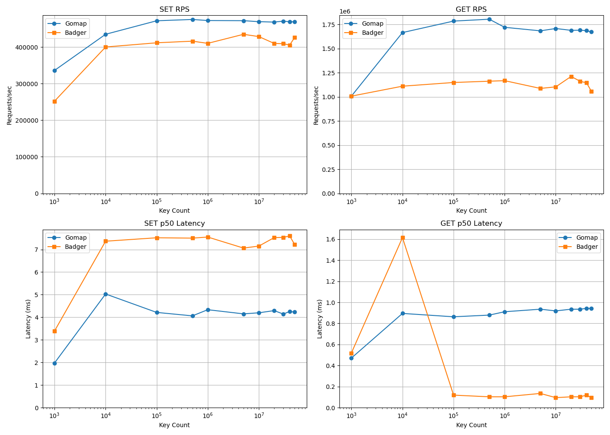

# gomap (dev): HashDB + TreeDB

This repo is a development playground for two storage engines plus benchmarking tools:

- **HashDB** (`HashDB/`, package `hashdb`): mmap-backed hash index + slab value log.
- **TreeDB** (`TreeDB/`, package `treedb`): persistent B+Tree with an optional cached write-back layer.
- **BTreeOnHashDB** (`HashDB/BTreeOnHashDB/`): a B-Tree built on top of HashDB (benchmark/comparison).
- **Unified Bench** (`cmd/unified_bench/`): runs a consistent workload across engines.

## Quickstart

- `make test`
- `make build`
- `make unified-bench && ./bin/unified-bench`

More docs:

- `docs/README.md`
- `docs/GETTING_STARTED.md`
- `docs/TREEDB_CACHED_VS_BACKEND.md`
- `CONTRIBUTING.md`

## Choosing An Engine

High-level guidance:

- **HashDB**: best for high-throughput random reads and perf experiments; durability is currently best-effort.
- **TreeDB (cached, default)**: best for workloads dominated by many small random writes; use `*Sync` for durability.
- **TreeDB (backend-only)**: best when you batch writes yourself or want the simplest engine path; scans can be faster.

Contracts (durability/locking/concurrency/iteration):

- `docs/contracts/README.md`

## Benchmarking

- `cmd/unified_bench/README.md`
- `docs/BENCHMARK_SPEC.md`

HashDB benchmark suite includes plots (example):

## Testing

- `go test ./...`
- `cd TreeDB && go test ./...`
- `cd cmd/unified_bench && go test ./...`

## Notes

- Exclusive open: TreeDB and HashDB take an exclusive lock on the DB directory (`ErrLocked`).
- On-disk formats and public APIs may evolve; see `docs/API_STABILITY.md`.
