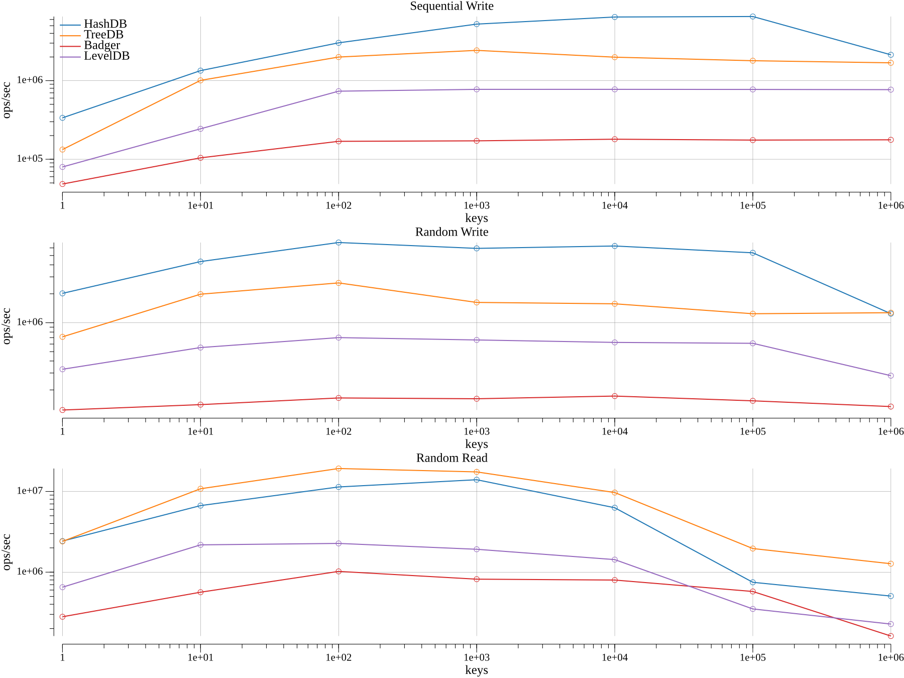
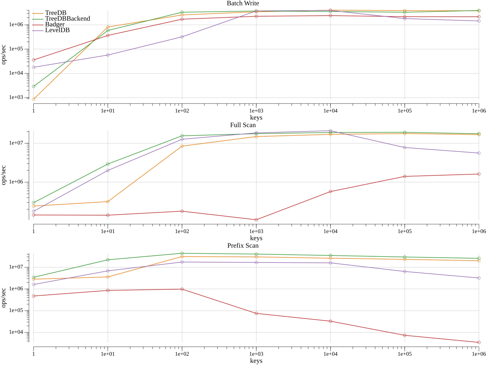

# gomap (dev): HashDB + TreeDB

This repo is a development playground for two storage engines plus benchmarking tools:

- **Status: pre-alpha.** APIs and on-disk formats may change without backward-compatibility guarantees.

- **HashDB** (`HashDB/`, package `hashdb`): mmap-backed hash index + slab value log.
- **TreeDB** (`TreeDB/`, package `treedb`): persistent B+Tree with an optional cached write-back layer.
- **BTreeOnHashDB** (`HashDB/BTreeOnHashDB/`): a B-Tree built on top of HashDB (benchmark/comparison).
- **Unified Bench** (`cmd/unified_bench/`): runs a consistent workload across engines.

## Quickstart

- `make test`
- `make build`
- `make unified-bench && ./bin/unified-bench`

More docs:

- `docs/README.md`
- `docs/GETTING_STARTED.md`
- `docs/TREEDB_CACHED_VS_BACKEND.md`
- `docs/TREEDB_CONCEPTS.md`
- `docs/TREEDB_STORAGE_FORMAT.md`
- `docs/TREEDB_RECOVERY.md`
- `CONTRIBUTING.md`

## Choosing An Engine

High-level guidance:

- **HashDB**: best for high-throughput random reads and perf experiments; use `PutSync`/`DeleteSync`/`ApplyBatchSync` for durable commits (non-`*Sync` writes are best-effort; sharded HashDB uses a write-back cache and can optionally enable a per-shard cache WAL via `OpenWithOptions`).
- **TreeDB (cached, default)**: best for workloads dominated by many small random writes; WAL on/off is configurable; use `*Sync` for durability.

Contracts (durability/locking/concurrency/iteration):

- `docs/contracts/README.md`

## Benchmarking

Primary tool: `cmd/unified_bench/` (side-by-side: HashDB, TreeDB, Badger, LevelDB).

- Run: `make unified-bench && ./bin/unified-bench`
- Sweep key counts (markdown output): `./bin/unified-bench -format markdown -keycounts 100000,1000000`
- Update the README benchmark snapshot: `make bench-readme`

More details:

- `cmd/unified_bench/README.md`
- `docs/BENCHMARK_SPEC.md`

<!-- BENCHMARK_START -->
_Generated by `go run ./cmd/unified_bench -suite readme -format markdown`._

_Generated at:_ 2025-12-16T22:33:24Z
_Environment:_ darwin/arm64 | Go go1.25.5 | CPUs 8 | RAM 16 GiB | CPU Apple M3 | Model Mac15,13
_Seed:_ 1

_Key counts:_ 1…1,000,000 (valsize=128, batchsize=1000, range-queries=200, range-span=100)

Notes:
- Results depend on hardware and OS.
- `HashDB` does not support ordered scans.

### Graphs

### Point Ops (writes + gets)

_Key counts:_ 1, 10, 100, 1,000, 10,000, 100,000, 1,000,000

#### Sequential Write

| keys | HashDB | TreeDB | Badger | LevelDB |
|---:|---:|---:|---:|---:|
| 1 | 510,725 | **1,712,329** | 54,918 | 263,713 |
| 10 | 1,983,340 | **3,528,582** | 178,571 | 326,083 |
| 100 | 4,780,800 | **5,063,291** | 168,812 | 419,287 |
| 1,000 | **7,192,123** | 3,799,262 | 248,669 | 463,043 |
| 10,000 | **11,378,182** | 4,221,413 | 218,227 | 499,895 |
| 100,000 | **9,683,472** | 2,512,929 | 216,848 | 397,116 |
| 1,000,000 | 1,424,436 | **2,226,944** | 203,911 | 198,315 |

#### Random Write

| keys | HashDB | TreeDB | Badger | LevelDB |
|---:|---:|---:|---:|---:|
| 1 | 1,600,000 | **3,003,003** | 218,198 | 300,030 |
| 10 | 3,478,261 | **4,444,444** | 223,464 | 446,090 |
| 100 | **5,429,766** | 4,116,582 | 58,857 | 409,417 |
| 1,000 | **7,899,893** | 3,092,777 | 183,454 | 445,244 |
| 10,000 | **7,544,084** | 2,304,435 | 202,036 | 435,469 |
| 100,000 | **5,498,282** | 1,724,264 | 174,231 | 202,791 |
| 1,000,000 | **1,286,706** | 1,133,272 | 141,807 | 83,609 |

#### Random Read

| keys | HashDB | TreeDB | Badger | LevelDB |
|---:|---:|---:|---:|---:|
| 1 | **2,000,000** | 1,600,000 | 269,687 | 1,333,333 |
| 10 | **9,606,148** | 6,317,119 | 995,818 | 1,764,602 |
| 100 | **10,908,694** | 8,571,184 | 822,761 | 3,234,571 |
| 1,000 | **15,604,763** | 5,578,801 | 705,592 | 2,977,670 |
| 10,000 | **16,003,201** | 4,215,999 | 1,154,268 | 2,170,453 |
| 100,000 | 451,616 | **1,765,626** | 663,813 | 277,092 |
| 1,000,000 | 255,763 | **618,247** | 299,327 | 162,509 |

### Batch + Scans

_Key counts:_ 1, 10, 100, 1,000, 10,000, 100,000, 1,000,000

#### Batch Write

| keys | TreeDB | Badger | LevelDB |
|---:|---:|---:|---:|
| 1 | **235,294** | 55,685 | 315 |
| 10 | **1,283,368** | 516,129 | 23,552 |
| 100 | **3,883,495** | 1,325,223 | 40,679 |
| 1,000 | **8,645,583** | 2,230,694 | 1,268,633 |
| 10,000 | 3,455,774 | 2,232,392 | 827,923 |
| 100,000 | 2,688,922 | 1,991,356 | 485,423 |
| 1,000,000 | **2,059,133** | 1,530,078 | 700,450 |

#### Full Scan

| keys | TreeDB | Badger | LevelDB |
|---:|---:|---:|---:|
| 1 | 44,944 | 81,360 | 158,932 |
| 10 | 53,214 | 186,047 | 2,329,916 |
| 100 | 6,946 | 20,000 | **3,438,435** |
| 1,000 | 49,793 | 163,265 | 20,184,894 |
| 10,000 | 357,143 | 461,531 | 22,643,646 |
| 100,000 | 200,988 | 1,331,842 | 6,679,896 |
| 1,000,000 | 1,503,759 | 940,402 | **2,987,744** |

#### Prefix Scan

| keys | TreeDB | Badger | LevelDB |
|---:|---:|---:|---:|
| 1 | 2,313,262 | 360,009 | 1,503,759 |
| 10 | 4,747,774 | 365,491 | 5,183,542 |
| 100 | 5,155,835 | 362,455 | 15,768,899 |
| 1,000 | 661,072 | 53,031 | 19,055,167 |
| 10,000 | 495,519 | 18,224 | 14,127,553 |
| 100,000 | 347,390 | 4,681 | 10,851,872 |
| 1,000,000 | 223,210 | 1,858 | 2,303,174 |

### Quick takeaways

- `HashDB`: great for high-throughput point reads/writes; no ordered scan API yet.
- `TreeDB` (cached): strong default for random-write-heavy workloads; scans include merge overhead.
- `Badger`/`LevelDB`: useful baselines with different storage tradeoffs.
<!-- BENCHMARK_END -->

## Testing

- `go test ./...`
- `cd TreeDB && go test ./...`
- `cd cmd/unified_bench && go test ./...`

## Notes

- Exclusive open: TreeDB and HashDB take an exclusive lock on the DB directory (`ErrLocked`).
- On-disk formats and public APIs may evolve; see `docs/API_STABILITY.md`.
