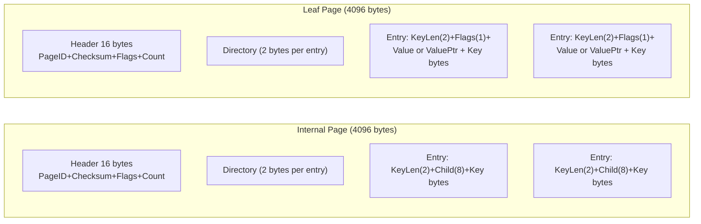
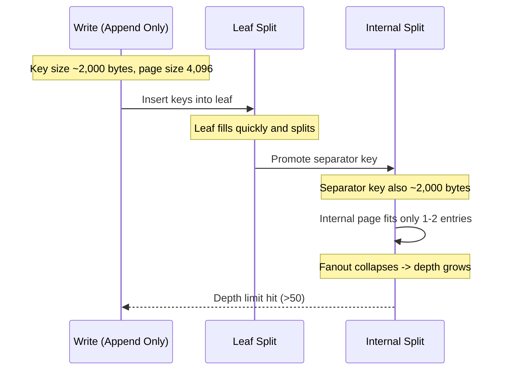
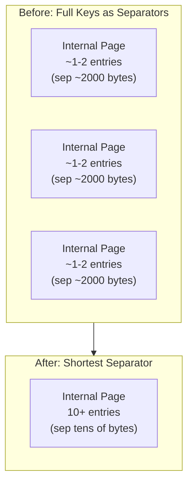

# B-Tree Key Size Pathology: Long Keys, Small Pages

This document explains why long keys (~2,000 bytes) can cause B-Tree depth growth in TreeDB's zipper index, why it is not related to value pointers, and how separator shortening restores fanout. It also outlines next steps for a future index/performance sprint.

## Summary

- The failure is an index depth limit hit (depth > 50) in the zipper, not a value storage issue.
- With 4KB pages, long separator keys reduce internal node fanout to 1-2 entries per page.
- Append heavy workloads then build a deep, stringy right spine and trip the depth limit.
- Separator shortening (shortest-separator) keeps internal keys small, increasing fanout and keeping depth shallow.

## Where the Size Pressure Comes From

The iavl-bench workload uses long keys (~2,000 bytes). That is close to half of a 4KB page, leaving little room for multiple separators in internal pages.

### Page Types on Disk

TreeDB uses fixed-size pages (4,096 bytes by default). Internal and leaf pages share a header and directory, but store different entry types.

Internal pages store only separator keys and child pointers. Leaf pages store full keys and values (or value pointers). The depth limit was triggered by internal pages having too few entries because separator keys were too large.

## What Separators Are (And Why They Matter)

In a B+ tree, internal nodes store separator keys that divide the keyspace between child pages. Those separators do not need to be full keys; they only need to preserve ordering boundaries.

When separators are large (near the size of leaf keys), internal nodes can hold only 1-2 children. That collapses fanout and increases depth rapidly.

## The Pathological Case With Long Keys

This explains why increasing `page.PageSize` temporarily made the bench pass: larger pages allow more separators per internal node, increasing fanout.

## Separator Shortening and Restored Fanout

The shortest-separator approach generates a boundary key that is as small as possible while still ordering correctly between the left max key and right min key. This can shrink internal keys dramatically even when leaf keys are huge.

Key idea: internal separators do not need full keys. Short separators increase fanout and keep depth shallow under append-heavy workloads.

## Why This Is Not About Value Pointers

Value pointers affect how leaf values are stored (inline vs slab). They do not change internal separators or fanout. The depth-limit error occurs in zipper internal merges before value pointers are relevant to the shape of the index.

## Next Steps (Future Performance Sprint)

1. Evaluate internal-key prefix compression (separate from leaf prefix compression).
2. Consider an internal-key policy: shortest-separator plus prefix truncation.
3. Add a depth limit accounting fix after collapsing single-child chains.
4. Add regression tests:
   - Long-key fanout regression (assert depth and max separator length).
   - Separator-length bound test (shortest-separator reduces size).
   - Depth resilience after single-child collapse.
5. Consider page size changes as a planned, versioned format bump.

## Debug knobs

- `TREEDB_ZIPPER_DEBUG_SEPARATORS=1` logs separator lengths for leaf splits and internal fanout during splits.
- `TREEDB_ZIPPER_DEBUG_SEPARATORS_EVERY=N` samples every Nth split log line (default 1).

## Current Status

- We confirmed the depth-limit failure is caused by large separators and low internal fanout.
- Shortest-separator improvements are in place and pass the long-key zipper regression tests.
- Depth limit is temporarily raised to 200 to keep iavl-bench running; revisit during the index optimization sprint.
- Increasing page size is a valid but format-breaking workaround that requires a dedicated migration plan.
