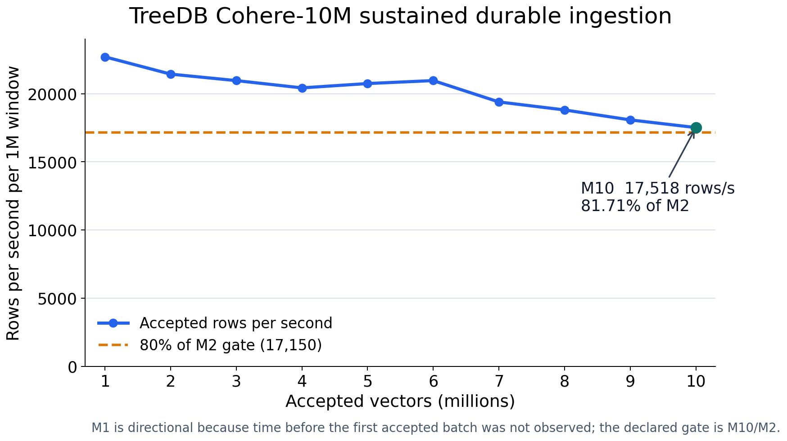

# TreeDB Cohere-10M load, build, reopen, and search qualification (2026-09-01)

TreeDB completed a production-shaped Cohere-10M lifecycle on AWS: 10,000,000
vectors were durably loaded, the deferred column graph was built, the service
was closed and cold-reopened, and the reopened index served the intended
scalar-u8 traversal plus FP32 rerank path. The run passed its sustained-load,
durability, reopen, search, and teardown gates.

This is one successful lifecycle qualification, not a dense recall/QPS curve or
a cross-database leaderboard result. The separate [Cohere 1M report](treedb_vectordbbench_cohere1m_c6i_dense_curve_2026-08-21.md)
owns TreeDB's dense search curves and directional public VDBBench comparison.

## Result summary

| Measurement | Result |
| --- | ---: |
| Accepted and cold-reopened rows | 10,000,000 exact |
| Durable insert | 502.3112 s (8.372 min; 19,908 rows/s) |
| Sustained throughput, M10/M2 | 81.7133% (gate: at least 80%) |
| Offline optimize | 6,296.3385 s (104.939 min) |
| Query-ready load plus optimize | 6,798.6497 s (113.311 min) |
| Cold health readiness | 34.21 s |
| Search QPS | 21,986.664 |
| Recall@100 / NDCG@100 | 0.9335 / 0.9425 |
| Concurrent p99 / p95 / average | 2.1638 / 1.8965 / 1.4436 ms |
| Peak service RSS | 75.480 GiB during build; zero swap |

No canonical product error, schema conflict, retry, corruption, fallback, or
partial index generation was observed.

## Exact candidate and topology

- TreeDB commit: `fcc1d79696a9b7c6655b793f6224f6937e698ce5`
  (merged PR #4584).
- TreeDB binary SHA-256:
  `6fa53430fee5c0e5425768f03869bdeb4a906e779417c1dd37c619f8e44eb770`.
- VectorDBBench commit: `52a46b55e41c34cfb86f8d21eafb70b4cca19787`.
- Server: `r6i.8xlarge`, 32 vCPUs / 16 physical cores, 256 GiB RAM,
  Intel Xeon Platinum 8375C, one NUMA node.
- Client: `c6i.4xlarge`, 16 vCPUs / 8 physical cores, Intel Xeon Platinum
  8375C.
- Placement: same subnet and AZ in `us-west-2a`; Ubuntu 24.04, kernel
  `6.17.0-1019-aws`.
- Data volume: encrypted 500-GiB gp3, 3,000 IOPS, 250 MiB/s, ext4.
- Dataset: Cohere-10M, 768 dimensions, cosine distance, `topK=100`.
- Load: 500 documents/request, 32 persistent workers,
  `command_wal_durable`, deferred column-graph build.
- Index/search: M16, efConstruction300, efSearch192, scalar-u8 traversal using
  `embedding.scalar_u8.fast`, and a configured FP32 rerank budget of 400.
  Because efSearch192 capped the candidate pool, the observed effective
  shortlist and exact-score count were both 192 rows/query.
- Timed search: `stats_mode=production`, IDs-only response, concurrency 32 for
  30 seconds.

## Sustained durable ingestion



The million-row windows come from 20,000 server-accepted 500-row batch events.
M1 is directional because the time before the first accepted batch was not
observed; the declared gate is M10/M2. The exact plotted values are in the
[companion CSV](treedb_vectordbbench_cohere10m_million_windows_2026-09-01.csv).

| Window | Seconds | Rows/s | Relative to M2 |
| --- | ---: | ---: | ---: |
| M1 | 44.0418 | 22,705.72 | 105.91% |
| M2 | 46.6465 | 21,437.84 | 100.00% |
| M3 | 47.7049 | 20,962.19 | 97.78% |
| M4 | 48.9513 | 20,428.46 | 95.29% |
| M5 | 48.2018 | 20,746.11 | 96.77% |
| M6 | 47.7024 | 20,963.30 | 97.79% |
| M7 | 51.5566 | 19,396.16 | 90.48% |
| M8 | 53.1600 | 18,811.12 | 87.75% |
| M9 | 55.3129 | 18,078.96 | 84.33% |
| M10 | 57.0855 | 17,517.57 | 81.71% |

The previous exact-main post-#4531 load took 1,786.410 seconds and ended at
62.81% M10/M2. This run reduced load duration by 71.88% (3.56x equivalent
throughput by wall time) and improved the sustained ratio by 18.90 percentage
points. Against the earlier complete matched run, insert fell from 2,593.554
seconds to 502.311 seconds, an 80.63% reduction.

## Durability, maintenance, and reopen

- Command-WAL active bytes peaked at 265,520,961 bytes (253.22 MiB), below the
  8-GiB guardrail, then reached zero active bytes and zero active segments.
- Cleanup removed 87,053,452,710 bytes across 346 covered segments while the
  durable and applied LSNs both reached 20,002.
- Thirty-six automatic checkpoints occurred through load completion; 40 total
  were visible after build/finalization.
- Deferred vector-build admission recorded 16 maintenance skips. No periodic
  online vacuum ran during ingestion; one coalesced finalization vacuum ran
  after load and completed in about 10.28 seconds.
- The first graceful close completed in 11.02 seconds. Cold health readiness
  completed in 34.21 seconds, and the cold validator proved the exact 10M count,
  index generation and configuration, optimized topK10/topK100 route, and no
  fallback.

The checked-in [cold-reopen proof](treedb_vectordbbench_cohere10m_cold_reopen_2026-09-01.json)
contains the exact count and optimized-route responses.

## Offline build breakdown

The service reported 6,242.111 seconds of column-graph construction inside the
6,296.3385-second VDBBench optimize wall. The counters below are inclusive where
noted and must not be summed.

| Stage | Time | Interpretation |
| --- | ---: | --- |
| Adjacency build | 5,774.242 s | 92.5% of column-graph time; principal wall |
| Asset preparation | 389.913 s | inclusive late materialization/publication |
| Publication | 389.988 s | overlaps the asset-preparation boundary |
| Search-pack preparation | 176.419 s | late query-layout materialization |
| File sync | 148.938 s across 6 syncs | visible, but not the dominant wall |
| Quantized preparation | 67.072 s | scalar-u8 asset construction |
| Row extraction | 39.244 s | typed-column scan/extraction |
| Row-reference preparation | 26.725 s | row mapping |
| Locality remap | 20.312 s | physical layout remap |
| Inverse norms | 16.365 s | FP32 norm preparation |
| Document IDs | 13.120 s | ID materialization |

The earlier complete matched build was about 104.17 minutes; this run was
104.94 minutes. The sustained-load wall is removed, while adjacency
construction now dominates time to ready.

## Resource and bottleneck attribution

During load, the server averaged 15.84% busy across 32 vCPUs (about 5.07
vCPUs), while the client averaged 6.89% across 16 vCPUs (about 1.10 vCPUs).
The gp3 device averaged 247.98 MiB/s writes against its 250-MiB/s provisioned
ceiling, with 8.89 ms average write await, 10.01 average queue depth, and 2.44%
server iowait. The client was not limiting; absolute ingestion on this matched
topology was materially EBS-throughput-limited.

The load CPU profile averaged 4.30 service CPUs. Its principal costs were JSON
float formatting and decoding, validation, copies, syscalls, value-log decode,
base64, and compression. The allocation capture reported 323.50 GiB cumulative
allocated space, including JSON marshal, `bytes.Clone`, command frame/payload
encoding, decoder refill, command-writer append, value-log decode, typed-column
construction, and base64. Those are optimization opportunities, but allocation
and GC did not reintroduce the sustained-throughput collapse.

During build, the server averaged 35.90% busy across 32 vCPUs (about 11.49
vCPUs). Writes averaged only 11.78 MiB/s and device utilization 4.65%, so gp3
was not the adjacency-build wall. The adjacency CPU profile was 49.65% flat in
the AVX-512 FP32 dot kernel and 17.92% flat in its indexed variant; graph
search-layer work was 68.09% cumulative and diversity selection 27.50%.
Traversal/data locality and candidate selection around vector math are the
remaining primary build ceiling.

A late serial phase used about one CPU. `buildInt64ValueRowIndex` accounted for
39.80% cumulative CPU there, with sorting/partitioning,
`buildGranulesAndLocators`, map lookup, validation, and copies. Peak build RSS
was 75.480 GiB and fell to 35.35 GiB after optimize; issue #4542 separately
tracks releasing completed-phase mappings/pages.

During the exact 30-second search interval, the server averaged 72.96% busy
(about 23.35 logical CPUs), the client averaged 38.74% busy (about 6.20 logical
CPUs), and iowait and steal were negligible. A separate diagnostic run
attributed 34.32% flat CPU to `dotScalarU8CenteredIndexedPreparedByte`, 66.77%
cumulative CPU to the prepared scalar-u8 score plane, and 9.74% flat CPU to the
AVX-512 FP32 rerank kernel. The intended scalar-u8 plus FP32-rerank path was
active; HTTP transport and the split client were not the measured ceiling.

## Search result

The production search row was:

```text
TreeDB scalar-u8 + FP32 rerank192 effective (configured budget400),
Cohere-10M, topK100,
M16 / efConstruction300 / efSearch192, concurrency32, 30s:
QPS 21,986.664; recall 0.9335; NDCG 0.9425;
concurrent p99 2.1638 ms; p95 1.8965 ms; average 1.4436 ms.
```

The earlier complete matched run reported 20,902.52 QPS, recall 0.9335, NDCG
0.9425, and p99 2.166 ms. This run improved QPS by 5.19% with quality and
latency parity.

## Cost and teardown

- Compute runtime was 2.328056 hours for the server and 2.327500 hours for the
  client. Captured on-demand rates were $2.016/hour and $0.680/hour,
  respectively.
- Compute cost was about $6.276. Estimated short-lived gp3/root-volume cost was
  about $0.16, for approximately $6.44 total campaign cost.
- The query-ready database occupied about 79 GiB. The retained encrypted EBS
  snapshot is `snap-08ce3b93c55890efe`; AWS reported `completed` and `100%`.
- Both instances and all campaign volumes, the key pair, and the security group
  were deleted. The checked-in [resource audit](treedb_vectordbbench_cohere10m_resource_audit_2026-09-01.json)
  found no unintended resources; only the explicitly retained snapshot remains.

## Evidence

Checked-in evidence:

| Artifact | SHA-256 |
| --- | --- |
| [VDBBench load result](treedb_vectordbbench_cohere10m_load_2026-09-01.json) | `13dd8a600a05e24bb3f16b97a5b04b07c3f8c849556ced68c9c56d9b12cfec4f` |
| [VDBBench production search result](treedb_vectordbbench_cohere10m_search_2026-09-01.json) | `73a588fa1c97ea2c1bcc25a00f3055262ad9e762f6235f2aa75ceb653f37d3a3` |
| [Cold-reopen proof](treedb_vectordbbench_cohere10m_cold_reopen_2026-09-01.json) | `33311289eb2cdb91aee88dce8cd1181a376b36a3d1d07e35477ea00345214829` |
| [Final AWS resource audit](treedb_vectordbbench_cohere10m_resource_audit_2026-09-01.json) | `ab0fdd23a1f7b9d05b902fac5e24c0543d5a52e11ddecd045cf64dc075692bfe` |
| [Million-window CSV](treedb_vectordbbench_cohere10m_million_windows_2026-09-01.csv) | `b7e8af469fd417188535c36c9d59f14b7fb0ffe7103022f6498099470956b6f8` |

The raw VDBBench load file owns the load/optimize wall timings and exact task
configuration. Its convenience `inserted_count` field is zero because that
runner did not populate it; the server lifecycle stream and cold-reopen
validator own the exact 10,000,000-row count. The timed search deliberately
used production statistics and an IDs-only response; the separate cold-reopen
proof owns the fail-closed route/configuration checks.

Bulky lifecycle events, server/client telemetry, CPU/heap/allocation/contention
profiles, Go traces, Linux perf captures, commands, logs, environment records,
pricing, and teardown evidence are in the sanitized archive:

```text
s3://treedb-benchmark-assets-941641221830-us-west-1/cohere-medium-10m/r6i8xl-lifecycle-20260901/treedb-cohere10m-qualification-post4584-20260901.tar.zst
```

Archive SHA-256:
`38f611ca27380ba2664ba6d3cd851e92121e000cc738272987ee8967b8a81298`.
The 18,412,182-byte AES256-encrypted object contains a verified 314-file
internal checksum manifest. It excludes the EC2 private key response, build
cache, compiled binaries, database, and dataset bytes.

## Claim boundaries

- This is a single successful exact-commit lifecycle run; it does not establish
  run-to-run variance.
- It is not a partitioned or multi-host Raft qualification.
- The one search configuration is not a recall/QPS frontier. Use the Cohere 1M
  report for TreeDB's dense search curves.
- Other databases were not rerun on this topology. The result must not be used
  as a same-hardware or matched-recall cross-database ranking.
- The retained EBS snapshot is a query-ready asset, not part of the portable
  evidence archive.
