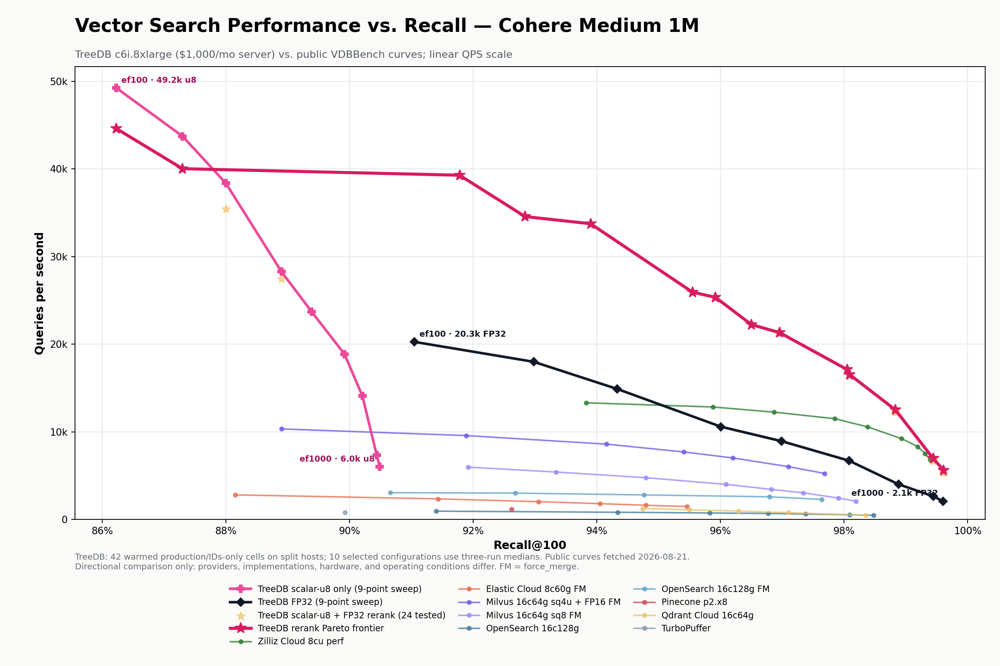

# TreeDB Cohere 1M dense recall/QPS curves on c6i.8xlarge (2026-08-21)

TreeDB's scalar-u8 plus FP32-rerank path reached a median peak of 33,749.90 QPS
at 0.9390 recall@100, 16,532.49 QPS at 0.9809 recall, and 6,969.31 QPS at
0.9944 recall. The complete current-run graph contains 42 TreeDB operating
points: nine scalar-u8-only, nine FP32 graph-traversal, and 24
scalar-u8-plus-rerank points.

The plot uses a linear QPS scale and includes all 49 points in the public
VDBBench Cohere Medium 1M snapshot fetched on 2026-08-21. The exact plotted
records are in the [companion CSV](treedb_vectordbbench_cohere1m_c6i_dense_points_2026-08-21.csv).

## Full scalar-u8-only and FP32 sweeps

`exact` below is the adapter's name for FP32 HNSW graph traversal; it is not an
exhaustive brute-force scan. Both sweeps used the same nine `efSearch` values.

| efSearch | Scalar-u8 QPS | Scalar-u8 recall | FP32 QPS | FP32 recall |
| ---: | ---: | ---: | ---: | ---: |
| 100 | 49,243.91 | 0.8623 | 20,268.10 | 0.9105 |
| 125 | 43,738.76 | 0.8730 | 17,993.98 | 0.9298 |
| 150 | 38,380.73 | 0.8800 | 14,896.42 | 0.9433 |
| 200 | 28,277.62 | 0.8890 | 10,582.96 | 0.9601 |
| 250 | 23,693.52 | 0.8939 | 8,934.04 | 0.9699 |
| 350 | 18,868.80 | 0.8992 | 6,709.38 | 0.9808 |
| 500 | 14,082.65 | 0.9021 | 4,016.45 | 0.9888 |
| 800 | 7,371.61 | 0.9044 | 2,649.44 | 0.9944 |
| 1000 | 6,033.45 | 0.9049 | 2,093.13 | 0.9960 |

Scalar-u8-only recall plateaus at about 0.905 for this index. FP32 traversal
reaches high recall but is substantially slower. Reranking preserves the
scalar-u8 traversal advantage: at 0.9944 recall, `efSearch=800` with a 500-row
rerank budget delivered 6,969.31 QPS versus 2,649.44 QPS for FP32 traversal at
the same `efSearch` and recall, a 2.63x difference.

## Selected scalar-u8 plus FP32-rerank points

These eight points are three-run medians. The range is the minimum and maximum
QPS across the three runs; p99 is the median peak-concurrency p99 reported by
VDBBench.

| efSearch | Rerank rows | Median QPS | QPS range | Recall | Peak p99 |
| ---: | ---: | ---: | ---: | ---: | ---: |
| 125 | 125 | 39,288.14 | 39,285.30-40,073.55 | 0.9178 | 1.47 ms |
| 150 | 150 | 33,749.90 | 33,626.25-34,359.78 | 0.9390 | 1.75 ms |
| 200 | 200 | 25,349.75 | 24,613.75-25,500.95 | 0.9592 | 1.76 ms |
| 250 | 250 | 21,314.47 | 20,567.64-21,424.26 | 0.9696 | 2.03 ms |
| 350 | 300 | 16,532.49 | 16,526.41-17,055.98 | 0.9809 | 2.66 ms |
| 500 | 300 | 12,510.70 | 12,118.81-12,620.58 | 0.9883 | 3.54 ms |
| 800 | 500 | 6,969.31 | 6,807.86-7,005.09 | 0.9944 | 5.73 ms |
| 1000 | 700 | 5,519.70 | 5,508.22-5,609.22 | 0.9961 | 12.79 ms |

The other 16 rerank cells are single-run budget-screening points. The scalar-u8
and FP32 `efSearch=150` rows in the full sweeps are also three-run medians, so
the campaign has 10 three-run-median configurations and 32 single-run cells. In
total, the campaign retained 62 successful timed runs with no failed cells.

## Directional public comparison

The nearest public Zilliz Cloud points give scale, not an apples-to-apples
ranking:

| TreeDB recall | TreeDB QPS | Public recall | Public QPS | QPS ratio |
| ---: | ---: | ---: | ---: | ---: |
| 0.9390 | 33,749.90 | 0.9383 | 13,316.23 | 2.53x |
| 0.9592 | 25,349.75 | 0.9588 | 12,837.53 | 1.97x |
| 0.9696 | 21,314.47 | 0.9687 | 12,248.92 | 1.74x |
| 0.9809 | 16,532.49 | 0.9785 | 11,501.67 | 1.44x |
| 0.9883 | 12,510.70 | 0.9893 | 9,227.32 | 1.36x |
| 0.9944 | 6,969.31 | 0.9939 | 6,813.24 | 1.02x |

TreeDB's 0.9961 point is above the maximum recall in this public snapshot
(0.9939). The public systems were not rerun on these hosts, and implementations,
hardware, pricing assumptions, and run conditions differ.

## Method and environment

- Dataset: Cohere Medium 1M, 768 dimensions, cosine, `topK=100`.
- Index: column HNSW, M=16, efConstruction=300, scalar-u8 index
  `embedding.scalar_u8.fast`, with optional FP32 rerank.
- Server: c6i.8xlarge in us-west-2a, 16 physical Ice Lake cores, 32 vCPUs,
  64 GiB RAM, 54 MiB L3, one NUMA node, and 12.5 Gbit/s networking.
- Client: separate same-AZ c6i.8xlarge, outside the leaderboard server budget.
- Storage: one 90 GiB gp3 volume per host. The budgeted server was
  $992.80/month compute plus $7.20/month storage using 730 hours, exactly
  $1,000/month.
- Campaign cost: approximately $9.80 for both hosts and volumes through verified
  teardown. Both instances terminated, both volumes were deleted, and the
  temporary security group and key pair no longer exist.
- Peak procedure: warmed search-only runs at concurrency 20, 30, 40, 60, and 80
  for 20 seconds each. The maximum-QPS stage supplies QPS and peak p99; VDBBench's
  1,000-query serial pass supplies recall.
- Service mode: `command_wal_durable`; every retained query used production
  diagnostic stats, IDs-only responses, and raw `f32_le` query transport.
- Strict preflight separately proved FP32, scalar-u8-only, and rerank routing,
  `topK=100`, the requested quantized index and rerank budget, no fallback or
  document fetches, and ordered-ID parity. Preflight and profiles were excluded
  from timed results.
- TreeDB source: `60ec6541907596fcf834f99f268a748312c1f24d`.
- TreeDB binary SHA-256:
  `083902fa7ebf64511ab37ece3cbb39c11dcc5661353ad706a0e097974dce938c`.
- VDBBench adapter: `d1564fdff9990f0accebddc75ea69574579f0e02`.
- Reopened snapshot SHA-256:
  `4401dc388f1245f55ec02c0ec974a1dee26ea24ccf8e542183a44968a61de887`.

A c6i.4xlarge client was attempted first and excluded after proving constrained:
at scalar-u8 `efSearch=100`, resizing the client to c6i.8xlarge raised QPS from
42,787.99 to 49,243.91 (+15.1%). On the retained c6i.8xlarge-client run's winning
concurrency-40 stage, the server was about 27.5% idle and the client about 60.7%
idle while network traffic was about 1.7 Gbit/s. Concurrency 60 pushed the
server close to full CPU but reduced QPS, pointing to core/SMT/cache/contention
limits rather than client, network, or storage saturation.

The warmed database occupied about 22 GiB. During steady search, the TreeDB
process was about 12.2 GiB RSS and 9.1 GiB PSS with about 0.85 GiB anonymous
memory and no swap. Representative cells recorded zero iowait and no EBS reads,
so gp3 was not on the measured search hot path.

## Profile findings

Four separate 60-second captures covered scalar-u8 at `efSearch=100`, rerank at
`efSearch=150` and 1000, and FP32 at `efSearch=1000`. CPU, heap, allocation,
block, mutex, trace, and host telemetry artifacts are in the evidence archive.

- Scalar-u8 indexed dot product consumed 34.71% of flat CPU at scalar-u8
  `efSearch=100` and 48.58% at rerank `efSearch=1000`; the prepared score-plane
  caller consumed another 15.45% and 18.69%, respectively.
- FP32 indexed dot product consumed 80.26% of flat CPU in the FP32
  `efSearch=1000` profile. The guest did not expose cycles or cache-miss PMU
  events, so arithmetic and memory-stall costs cannot be separated here.
- The low-`efSearch` scalar-u8 and rerank captures attribute 194-202 cumulative
  seconds of `RWMutex.RLock` delay to
  `documentservice.(*Service).acquireBenchmarkSearchIndex` in each 60-second
  profile. The service retains that cache read lock for the query lifetime. The
  attribution mostly disappears at high `efSearch`, where QPS is lower. This is
  the clearest high-QPS ownership boundary to audit, but it needs an unprofiled
  A/B test before assigning a QPS gain.
- The Go heap was about 343-414 MiB. Its largest live buckets were value-log
  decode scratch (about 141-148 MiB), native uint16 search scratch (about
  74-96 MiB), and grouped-frame cache (about 52-58 MiB).

The next optimization split is therefore workload-dependent: audit the
query-lifetime benchmark-index cache lock at the low-`efSearch` high-QPS end,
and continue vector-row/graph locality work at the high-recall end. More HTTP or
allocation work is lower priority until those two ceilings are measured.

## Evidence and caveat

Evidence archive:

`s3://treedb-benchmark-assets-941641221830-us-west-1/cohere-medium-1m/c6i8xl-dense-curve-20260821/treedb-vdbbench-c6i8xl-dense-curve-20260821.tar.zst`

SHA-256: `55bfa9969229765162f24a486b5c9824b5fec708dc3b2ef158b024271f11a9e6`

The archive contains commands, manifests, every retained and excluded result,
host telemetry, profiles, traces, plot source, the public snapshot, reducer
output, and teardown proof. The graph is a directional overlay of this TreeDB
campaign and the [public VDBBench leaderboard](https://zilliz.com/vdbbench-leaderboard?dataset=vectorSearch),
not an official submission or same-hardware reproduction of the other systems.
