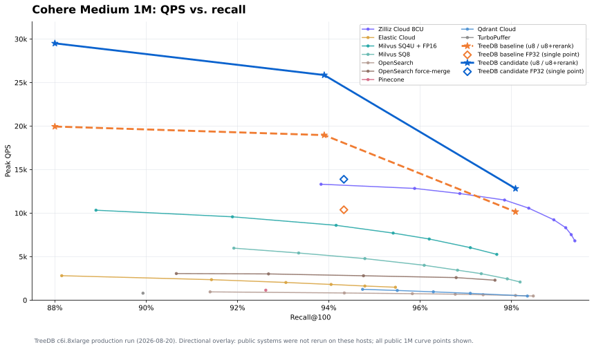
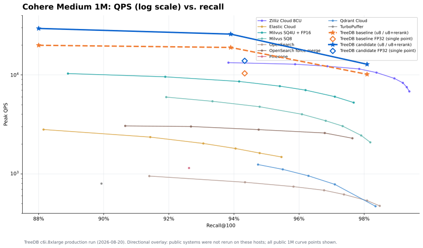
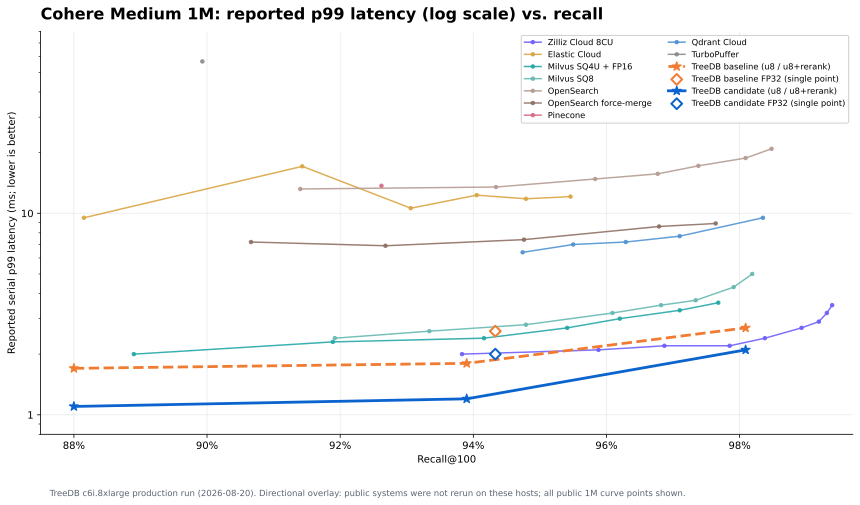
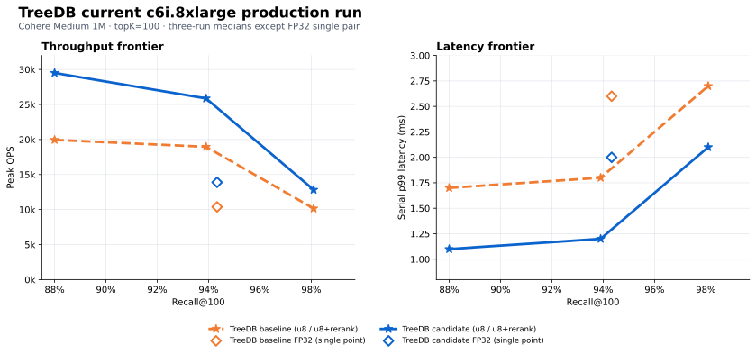

# TreeDB Cohere 1M c6i.8xlarge production qualification (2026-08-20)

TreeDB's service-transport candidate improved median peak throughput by 36.4% at matched recall and by 26.3% at the higher-recall point. These are paired TreeDB results from separate c6i.8xlarge server and client hosts; public VDBBench curves below are directional references, not same-host reproductions.

| Workload | Baseline QPS | Candidate QPS | Gain | Shared recall@100 | Candidate p99 |
| --- | ---: | ---: | ---: | ---: | ---: |
| scalar-u8 + FP32 rerank, ef150/r150 | 18,961.83 | 25,862.73 | +36.4% | 0.9390 | 1.2 ms |
| scalar-u8 + FP32 rerank, ef350/r300 | 10,152.05 | 12,821.00 | +26.3% | 0.9809 | 2.1 ms |
| scalar-u8 only, ef150 | 19,949.18 | 29,506.15 | +47.9% | 0.8800 | 1.1 ms |
| FP32 exact, ef150 (single pair) | 10,381.90 | 13,886.94 | +33.8% | 0.9433 | 2.0 ms |

The first three rows are medians of three paired, alternating-order repetitions. The FP32 row is one paired sweep and is therefore plotted as an isolated point rather than a curve.
The recall value in each row was identical for baseline and candidate; the companion CSV records both points separately.

## Performance and recall

The linear view emphasizes the measured TreeDB throughput. The log view keeps every lower-throughput public curve legible.

## Reported latency and TreeDB frontier

The TreeDB star curves connect scalar-u8-only and scalar-u8-plus-rerank operating points from this campaign. FP32 diamonds remain isolated because only one FP32 setting was measured per revision.

## Method and environment

- Dataset: Cohere Medium 1M, 768 dimensions, cosine, `topK=100`.
- Index: column HNSW, M=16, efConstruction=300; scalar-u8 traversal with optional FP32 rerank.
- Topology: separate c6i.8xlarge server and client in the same us-west-2a subnet. Each had 16 physical Ice Lake cores, 32 vCPUs, 64 GiB RAM, and 12.5 Gbit/s networking.
- Budgeted server: c6i.8xlarge at $992.80/month plus 90 GiB gp3 at $7.20/month, exactly $1,000/month using 730 hours. Client cost was separate.
- Peak procedure: concurrency 20, 30, 40, 60, and 80 for 30 seconds each. Warmups and profiled rows were excluded from medians.
- All 27 retained timed/profile command manifests explicitly used `--stats-mode production`.
- This campaign did not use `unified-bench`, so no cross-database preset applies. Every baseline and candidate server used the same resolved TreeDB profile, `command_wal_durable`: canonical peak runs passed `-profile command_wal_durable`, while the profiling binary constructs `OptionsFor(ProfileCommandWALDurable)` directly. This enables the command WAL with durable acknowledgement, verifies value-log read checksums, and disables writable value-log mmap; no WAL-off, relaxed-sync, or checksum-skip override was used. The archived `collected/server/bin/start-server.sh`, service logs, and 27 client command manifests preserve these settings for every retained run.
- Baseline TreeDB: `9bb3088ce2ecc0bddcd02500e2ca6e379691ae73`.
- Benchmarked candidate: `f59c62a77230b24e52072fd89713393b1f12a38e` from PR #4220. Its later proxy-bypass and HTTP-error handling fixes did not alter the direct no-proxy benchmark path and were not rebenchmarked.
- VDBBench adapter: `d1564fdff9990f0accebddc75ea69574579f0e02` from `snissn/vectordbbench` PR #7.

Strict diagnostic preflight separately proved exact, scalar-u8-only, and rerank routing; `topK=100`; no fallback or document fetches; the requested quantized index; rerank activation and budget; and identical ordered IDs across compact/full and raw/base64 representations.

## Acceptance gates

| Gate | Required | Observed | Result | Archived evidence |
| --- | --- | --- | --- | --- |
| exact FP32 comparator | measured at `topK=100` with route/parity proof | baseline and candidate ef150 pair; recall 0.9433 | pass | `reports/fp32_comparator_runs.json`; preflight artifacts |
| scalar-u8-only route | quantized traversal, no fallback/document fetch | ef150 curve point; recall 0.8800 | pass | `reports/official_peak5_summary.json`; preflight artifacts |
| scalar-u8 + rerank route | rerank active with requested budget | ef150/r150 and ef350/r300 points | pass | `reports/official_peak5_summary.json`; preflight artifacts |
| matched recall | at least 0.9383 | 0.9390 for baseline and candidate | pass | `reports/campaign-manifest.json` |
| candidate median peak QPS | at least 5% gain | +36.4% | pass | `reports/campaign-manifest.json` |
| candidate p99 | no more than 10% regression | 1.8 to 1.2 ms (-33.3%) | pass | `reports/campaign-manifest.json` |
| candidate allocation | at least 50% lower and at most 26 KiB/query | -66.3%; 17.05 KiB/query | pass | representative allocation profiles; `reports/campaign-manifest.json` |
| steady-state memory | bounded and stable | high-recall RSS 10.036 to 9.992 GiB; anonymous 1.364 to 1.321 GiB | pass | profile host/process telemetry |

No acceptance gate missed. All evidence paths above are relative to the checksum-addressed campaign archive listed below; profiled rows were separate from peak-QPS medians.

## Resource findings

The candidate removed the client transport bottleneck: active opens fell from about 14,424/sec to 0.4/sec, and the candidate client was 81.9% idle at the matched-recall profile point. Search was not storage-bound: TreeDB recorded no process reads or major faults during representative profiles, server iowait was effectively zero, and EBS averaged 0.4-1.2% utilization.

The remaining bottleneck was server CPU. At high recall, the profile accumulated 30.66 CPU-seconds/second on 32 vCPUs. Scalar-u8 AVX-512 VNNI scoring consumed 60.8% of CPU, graph traversal and score-plane work 13.7%, and FP32 rerank 6.4%. Representative allocation fell from 50.64 to 17.05 KiB/query (-66.3%).

## Sources and caveat

The plots contain all 49 public Cohere Medium 1M curve points exposed by the [VDBBench leaderboard](https://zilliz.com/vdbbench-leaderboard?dataset=vectorSearch) on 2026-08-20 plus only the eight TreeDB points from this c6i campaign. The exact plotted records are in [the companion CSV](treedb_vectordbbench_cohere1m_c6i_plotted_points_2026-08-20.csv).

The public systems were not rerun on the TreeDB hosts. Hardware, software revisions, and run conditions may differ, so the overlays are directional and must not be described as an official apples-to-apples leaderboard submission.

Evidence archive:

`s3://treedb-benchmark-assets-941641221830-us-west-1/cohere-medium-1m/c6i8xl-production-20260820/treedb-vdbbench-c6i8xl-production-20260820.tar.zst`

SHA-256: `fa9ae6d33a47fb9796b010f10b92ea2e0634642c5a09da548d819b742fb9d120`

Plots, source snapshot, and generator:

`s3://treedb-benchmark-assets-941641221830-us-west-1/cohere-medium-1m/c6i8xl-production-20260820/graphs/`
