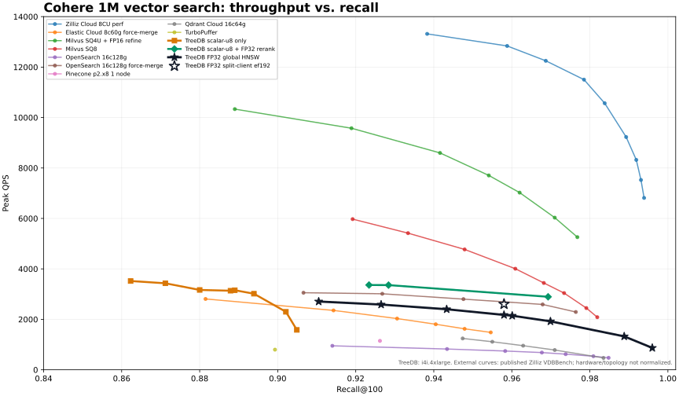
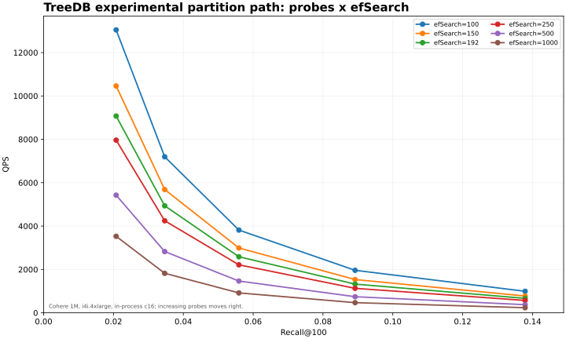

# TreeDB Cohere 1M recall/QPS curves on AWS i4i.4xlarge

Run date: 2026-08-19 UTC. This report contains two TreeDB characterizations:
the VDBBench-compatible global FP32 HNSW path and the experimental persistent
graph-partition/router/local-HNSW path. The partition path is an in-process
harness, so it is not a leaderboard result. External curves are published
reference targets, not hardware-normalized comparisons. The
[machine-readable result](treedb_vectordbbench_cohere1m_i4i_fp32_curve_2026-08-19.json)
contains both complete curves and the resource summary.



## Setup

- TreeDB commit: `8c6ef66003008ed68848e89369fbf127a46cb3a4`
- VDBBench commit: `8fd8abccc6ecf769600292f0274673a18e6834b9`
- Server: AWS `i4i.4xlarge`, `us-west-1a`, Intel Xeon Platinum 8375C,
  16 vCPU / 8 physical cores, 123 GiB RAM, local instance-store NVMe
- Dataset: Cohere Medium 1M, 768-dimensional FP32 vectors, cosine, recall@100
- Global index: HNSW `M=16`, `efConstruction=300`, exact FP32 scoring
- VDBBench responses: IDs only
- The database, binary, dataset, profiles, and results lived on instance-store
  NVMe. The gp3 root volume held only the OS.

## Global FP32 `efSearch` curve

Each row is the best same-host VDBBench concurrency cell for that `efSearch`.
The recall pass is VDBBench's 1,000-query serial pass. Concurrent p99 is shown
for topology diagnosis; it is not the leaderboard's separate serial p99.

| efSearch | recall@100 | peak QPS | concurrency | concurrent p99 ms | host busy | service CPU | client CPU |
| ---: | ---: | ---: | ---: | ---: | ---: | ---: | ---: |
| 100 | .9105 | 2,706.21 | 30 | 33.9 | 89.5% | 1,018% | 409% |
| 120 | .9265 | 2,586.52 | 30 | 36.1 | 90.4% | 1,037% | 404% |
| 150 | .9433 | 2,399.96 | 30 | 40.0 | 88.0% | 1,028% | 351% |
| 192 | .9580 | 2,174.74 | 30 | 44.2 | 88.3% | 1,055% | 330% |
| 200 | .9601 | 2,143.86 | 20 | 27.6 | 87.6% | 1,085% | 313% |
| 250 | .9699 | 1,920.15 | 20 | 34.8 | 88.5% | 1,132% | 285% |
| 500 | .9888 | 1,324.54 | 40 | 111.8 | 88.1% | 1,204% | 204% |
| 1000 | .9960 | 867.87 | 60 | 275.0 | 88.7% | 1,263% | 158% |

The low FP32 point in the earlier plot was therefore an `efSearch` choice, not
an FP32 accuracy ceiling. The curve reaches .9601 recall at 2,144 same-host QPS
and .9960 at 868 QPS.

## Client topology

The `efSearch=192` cell was repeated with VDBBench on a same-AZ
`c7i.4xlarge`, pinned to eight vCPUs, while the `i4i.4xlarge` served TreeDB.

| concurrency | 1 | 5 | 10 | 20 | 30 | 40 | 60 | 80 |
| ---: | ---: | ---: | ---: | ---: | ---: | ---: | ---: | ---: |
| QPS | 261.27 | 1,202.73 | 1,954.96 | 2,544.94 | 2,573.47 | 2,597.51 | **2,604.38** | 2,551.30 |

Recall remained .9580; serial p99/p95 were 6.2/4.3 ms. Peak throughput was
19.75% above the same-host 2,174.74 QPS point. At concurrency 60 the server was
94.6% busy and TreeDB used about 1,509% CPU, with zero I/O wait. The client was
only 12-13% busy and used about two CPUs; network traffic was about 12 MiB/s in
and 22 MiB/s out at the server. The separate-client topology is required for a
fair peak-QPS run, but neither the client nor network was the split-run limit:
the server CPU was.

## Global query profiles

Representative 45-second profiles were captured at `efSearch=100`, 192, and
1000. The AMD64 AVX-512 indexed dot kernel rose from 30.35% to 41.13% to 59.41%
of CPU as search widened. A separate issue dominates the low-`efSearch` case:
`runtime.memclrNoHeapPointers` consumed 33.35% at 100 and 8.90% at 1000.

Allocation deltas attribute 98.24%, 97.74%, and 92.84% respectively to native
search scratch preparation. The document service creates a fresh
`VectorIndexSearchBuffer` per HTTP request, which allocates and clears roughly
8 MiB of visited-state scratch per query. The collection's unbuffered exact
route already pools this object; a service-level acquire/release pool is the
smallest query-side fix. This run does not include that fix.

## Persistent graph-partition experiment

The experimental path uses the same authoritative 1M FP32 vectors and truth
set. It built 561 byte-planned partitions with 20% useful-only overlap, graph
degree 16, local HNSW `M=18` / `efConstruction=256`, and a persistent
representative router. Queries sweep partition probes and local `efSearch` with
top-100 and concurrency 16. Unlike the global curve, the harness runs directly
in the TreeDB process without HTTP or VDBBench, so only recall direction and
internal bottlenecks should be compared.



The current selected production policy is router candidate budget 256 and two
partition probes. Its recall was only .03467 at `efSearch=100`; raising local
`efSearch` to 1000 did not change recall. Recall remained exactly constant
across every local `efSearch` value at each probe count:

| probes | recall@100 | QPS ef100 | QPS ef192 | QPS ef1000 |
| ---: | ---: | ---: | ---: | ---: |
| 1 | .02077 | 13,045.11 | 9,072.40 | 3,528.14 |
| 2 | .03467 | 7,194.44 | 4,934.82 | 1,822.46 |
| 4 | .05592 | 3,815.60 | 2,584.62 | 917.66 |
| 8 | .08920 | 1,960.42 | 1,323.76 | 468.74 |
| 16 | .13789 | 991.93 | 666.23 | 235.51 |

This is routing/partition-coverage loss, not an `efSearch` ceiling. Increasing
local work scans more edges inside the selected partitions but cannot recover
neighbors that routing excluded. For example, at 16 probes local edges per
query rose from 58,453 at ef100 to 576,821 at ef1000 while recall stayed
.13789 and QPS fell 4.2x. Every one of the 25 cells above ef100 is strictly
dominated by the ef100 cell at the same probe count.

The experiment did exercise the recent persistent partition stack: byte-planned
shards, useful-only overlap, graph-derived memberships, 561 persisted local
HNSW packs, the representative HNSW router, a generation reader pin, and the
generation search-open plan. It was not the ordinary global HNSW path.

### Query utilization

Each point performs a serial 1,000-query recall pass followed by the 16-worker
throughput window. Across the measured windows the host averaged 99.81% busy
and the process used 1,593.9% CPU. NVMe input and I/O wait were effectively
zero. The full 30-cell process averaged 8.22 GiB RSS and peaked at 15.10 GiB,
with no swap or major page faults. This in-process route has no separate client:
its measured limit is server CPU.

### Partition query profiles

Three 45-second CPU, heap, and allocation samples were captured after the
single cold reopen. All three throughput windows saturated the 16-vCPU host
without reading from NVMe:

| probes | efSearch | recall@100 | QPS | p99 ms | host busy | process CPU | RSS GiB |
| ---: | ---: | ---: | ---: | ---: | ---: | ---: | ---: |
| 2 | 100 | .03467 | 7,158.60 | 2.680 | 97.68% | 1,561% | 8.07 |
| 16 | 100 | .13789 | 978.86 | 25.973 | 97.35% | 1,557% | 8.32 |
| 16 | 1000 | .13789 | 234.04 | 75.604 | 97.67% | 1,561% | 8.44 |

At the selected two-probe policy, local HNSW search was 61.68% cumulative CPU,
deterministic candidate canonicalization was 28.41%, and routing was 12.04%.
At 16 probes / ef100 those shares were 61.53%, 31.47%, and 2.02%. At 16
probes / ef1000, exact canonicalization rose to 66.91% while local HNSW search
fell to 31.61%; the AVX-512 indexed dot kernel itself was only 16.35%.

The high-ef cost is therefore not simply an unoptimized distance kernel. The
path exactly re-scores the candidates returned by every selected partition
using the deterministic public binary64 accumulation contract. Successive
allocation snapshots recorded 16.7 GiB and 5.38 GiB of additional allocation
over the complete p16/ef100 and p16/ef1000 phases; the lower latter total is a
consequence of much lower query throughput. Live heap rose from 734 MiB to
1.06 GiB to 1.16 GiB, led by retained native candidate and visited scratch.
Memory is not the present hardware limit, but pooling and bounding this scratch
will matter when choosing a smaller-RAM, higher-vCPU instance.

The next quality experiment should not build another index. On the archived
assets, measure truth-neighbor partition coverage for both exact representative
ranking and the current approximate router. If exact ranking has the same low
ceiling, change the partition memberships/representatives or overlap objective;
if exact ranking is materially better, fix router recall/candidate budgeting.
Until that split is known, `efSearch=100` dominates every tested higher local
value. After route coverage is qualified, the query-side CPU order is:

1. deduplicate overlap candidates before deterministic canonical rescoring;
2. reuse one normalized query and pooled result/scratch buffers across probes;
3. then optimize the contract-preserving canonical scorer or deliberately
   revise that bit-level public contract.

### Build utilization

The first complete graph/local-asset pass spent 22m20s in graph construction
and 14m54s materializing 561 local HNSW packs. Both phases averaged about 102%
process CPU and only 6.4% whole-host busy, with effectively zero I/O wait.
Average RSS was 11.4 GiB then 17.7 GiB; peak RSS was 28.1 GiB, with no swap.

The full CPU profile splits 55.64% cumulative time into the generic robust
partition distance routine and 31.45% into local HNSW construction. The graph
routine spends most of that work in scalar `float64` distance and `math.Max`;
the local builder already spends 58.43% of its sampled CPU in the AVX-512 FP32
dot kernel. The highest-leverage build changes are therefore:

1. pre-normalize graph vectors and use a prepared dot-distance path;
2. build independent per-partition local HNSW packs with bounded workers and
   deterministic ordered publication; and
3. stream or bound completed payload retention to reduce the 28.1 GiB peak.

The current router's configured/hard scalar-work ceiling is 50 billion, while
this 1M/561-partition manifest estimates 943.7 billion. The benchmark used a
disposable checkout with a 1-trillion ceiling; that override is not committed
and is part of the experimental qualification scope.

Router construction then took 6m16s for 8,976 representatives and produced a
31,704,776-byte pack. It averaged about one CPU despite the 16-vCPU host. Its
CPU profile attributes 75.57% to the scalar normalized cosine-distance loop;
the first router-build optimization is the same prepared/SIMD dot path already
used by local HNSW.

Reopening all 561 local packs took 38m36s before the first query. The newer
generation search-open plan removed repeated manifest work, but every local
searcher still validated/prepared the same 3.29 GiB authoritative source.
Userspace read more than 1.84 TiB from warm page cache with zero block-device
reads. A 30-second profile attributed 31.17% to CRC32 and 26.95% to
`prepareSectionViewsWithContext`. Generation-scoped prepared source/checksum
state should be shared across local searchers; this is a CPU cold-start defect,
not an NVMe problem.

## External reference curves

The plot includes all 49 Cohere 1M points exposed by the
[Zilliz VDBBench leaderboard](https://zilliz.com/vdbbench-leaderboard?dataset=vectorSearch)
snapshot retrieved 2026-08-18: Zilliz Cloud, Elastic Cloud, Milvus SQ4U with
FP16 refinement, Milvus SQ8, both OpenSearch series, Pinecone, Qdrant Cloud,
and TurboPuffer. It also retains the earlier TreeDB scalar-u8 and
scalar-u8-plus-FP32-rerank curves.

The external series differ in encoding, refinement, server/client topology,
storage, and sometimes managed-service hardware. They are targets, not a
ranking of this run. The closest published Milvus SQ4U bracket remains
.9541/7,704 QPS and .9620/7,024 QPS; TreeDB's split-client FP32 point is
.9580/2,604 QPS, a 2.70-2.96x raw-QPS target gap. Normalizing only the
$1,105.22/month i4i server to $1,000/month gives 2,356 QPS and a 2.98-3.27x
arithmetic gap; neither comparison controls for encoding or topology.

## Artifacts and cost

The reusable pre-partition database asset is:

`s3://treedb-benchmark-assets-941641221830-us-west-1/cohere-medium-1m/scalar-u8/m16-efc300/gomap-8c6ef660/treedb-cohere1m-scalar-u8-m16-efc300-8c6ef660.tar.zst`

Its size is 14,324,223,569 bytes and SHA-256 is
`3117753d7ab795b02fc1c1c89ac3ab074d0ea44ae8109124b1a65c3fb13c9aee`.
Raw curves, profiles, telemetry, provenance, scratch source, and the final
post-partition database archive are under:

`s3://treedb-benchmark-assets-941641221830-us-west-1/cohere-medium-1m/runs/2026-08-19-i4i4xl-fp32-curves/`

The reusable post-partition database is:

`s3://treedb-benchmark-assets-941641221830-us-west-1/cohere-medium-1m/partitioned/graph-v1-local-m18-efc256/gomap-8c6ef660/treedb-cohere1m-partitioned-p561-o20-m18-efc256-8c6ef660.tar.zst`

Its size is 17,873,167,472 bytes and SHA-256 is
`2fe29f50e28408a72c153a6e8846badc61e24206c7ef2f00099cadc1e4e98c4d`.
Restore it to instance-store NVMe with:

```sh
aws s3 cp s3://treedb-benchmark-assets-941641221830-us-west-1/cohere-medium-1m/partitioned/graph-v1-local-m18-efc256/gomap-8c6ef660/treedb-cohere1m-partitioned-p561-o20-m18-efc256-8c6ef660.tar.zst - \
  | tar -C /mnt/nvme/db -I zstd -xf -
```

The server ran 14,549 seconds at $1.514/hour ($6.1187). The split client ran
2,471 seconds at $0.8904/hour ($0.6112), for $6.7298 total on-demand compute.
S3 storage/requests, data transfer, and the small root volumes are excluded.
Both EC2 instances are terminated and the temporary benchmark security group
was deleted.
